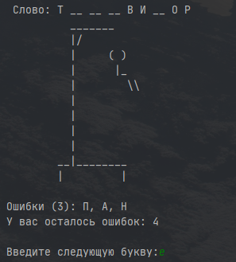

## Игра "Виселица"

Разработано на ruby `2.7.1`

### Правила игры

Компьютер загадывает слово (из списка в файле `data/words.txt`)
и показывает, сколько в нем букв. Игрок вводит буквы по 
одной. 
Если буква есть в слове, компьютер показывает, 
сколько раз она она в нём встречается и на каких местах.
Если буквы нет, компьютер засчитывает ошибку. Если слово 
отгадано полностью, то игрок победил. После каждой ошибки 
дорисовывается фрагмент виселицы, визуализирующий оставшиеся 
попытки игрока. Всего можно сделать 7 ошибок.

### Запуск игры
* `git clone git@github.com:IlyaKokorev/hangman.git`
* `cd ./hangman`
* `ruby main.rb`

### Добавление новых слов в игру. 

Для добавления нового слова добавьте его в верхнем регистре отдельной строкой в data/words.txt

#### Скриншот игры 

